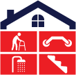

# Fall Safe Home Solutions — Website

Static HTML site for Fall Safe Home Solutions, an aging-in-place home modification business based in Oklahoma City.

Owner: Mickey Dollens — 405-445-4505 — mickeydollens@gmail.com
Domains: fallsafehomesolutions.com / fallsafehomes.com (linked, hosted via GoDaddy)

## Files

```
index.html                                — Home (hero, services, process, subscription, contact form)
about.html                                — Mickey & Connie Dollens story
services.html                             — Services + financing + assessment
blog.html                                 — Blog index
blog/aging-in-place-oklahoma.html         — Long-form SEO post
blog/bathroom-fall-prevention.html        — Long-form SEO post
blog/medicare-home-modifications.html     — Long-form SEO post
thank-you.html                            — Form-submission landing page
styles.css                                — Site styles
script.js                                 — Mobile nav toggle
sitemap.xml                               — For Google Search Console
robots.txt                                — Search engine directives
```

## How the contact form works

The form on `index.html` posts to **FormSubmit.co**, a free service that emails form submissions to `mickeydollens@gmail.com` without requiring a backend.

**First-time activation:**
1. Upload the site and visit it live at fallsafehomesolutions.com.
2. Submit the contact form once with any test info.
3. FormSubmit will send an activation email to mickeydollens@gmail.com — click the confirmation link in that email.
4. After that first activation, all submissions arrive automatically.

The form is configured with:
- `_subject` — sets the email subject line
- `_template: table` — formats the email nicely as a table
- `_captcha: true` — built-in spam protection
- `_next` — redirects to thank-you.html after submission
- `_honey` — hidden honeypot field for bot defense

## Uploading to GoDaddy

1. Log into GoDaddy → My Products → cPanel/File Manager (or use FTP).
2. Upload all files inside this folder to `public_html/` (the web root).
3. Make sure `index.html` is at the root, the `blog/` folder is preserved, and `styles.css`/`script.js` are at root level.
4. Visit fallsafehomesolutions.com to confirm everything renders.

## SEO checklist (post-launch)

- [ ] **Google Business Profile** — Create at google.com/business. Use name "Fall Safe Home Solutions", address (OKC), phone 405-445-4505, business hours, and the services category "Home improvement" + "Disabled adjustment services". This is the #1 thing for local SEO and reviews.
- [ ] **Google Search Console** — Add fallsafehomesolutions.com, verify ownership, submit `/sitemap.xml`.
- [ ] **Bing Webmaster Tools** — Same idea. Submit sitemap.
- [ ] **Citations** — Get listed on: Yelp, Angie's List, BBB Oklahoma, NextDoor, and aging-in-place-specific directories like AgeSafeAmerica and CAPS.
- [ ] **Reviews** — Once Google Business is live, ask first 5 customers to leave reviews — this is the single biggest local-SEO lever.

## Helping LLMs (Claude / ChatGPT / Perplexity) cite the site

LLMs cite content they trust. To improve the chance they pull from this site when users ask "aging in place Oklahoma City":
1. The site already has **JSON-LD structured data** for `HomeAndConstructionBusiness` (homepage) and `BlogPosting` (each blog post). Keep this.
2. Publish blog posts regularly — long-form, factually accurate, with clear headings. The three starter posts are templates; add 1–2 per month.
3. Make sure the contact info is **identical everywhere** (name, address, phone) — across the site, Google Business, Yelp, etc.
4. Get backlinks from Oklahoma elder-care orgs, the OK State Department of Health, AAA agencies, and tribal housing offices. LLMs heavily weight content that&apos;s referenced from authoritative third-party sources.
5. Submit articles to local news outlets — the Oklahoman, KOCO, KFOR — when there&apos;s a hook (Mickey is a public figure, that helps).

## Brand colors & logo

The site is now styled to match the Fall Safe Home Solutions logo:

- **Navy** `#1a2b5e` — headings, header, primary brand color
- **Red** `#e31e26` — CTAs, "red square" accents, service icons, step numbers
- **White** / off-white `#fafbfd` — backgrounds
- **Light gray** `#f3f5fa` — section backgrounds

All colors are CSS variables defined at the top of `styles.css` (`--navy`, `--red`, `--cream`, `--sand`). To tweak the exact red or navy to match the AI file's spec, edit those values once and every page updates.

### Swapping in the real logo file

The header mark is currently an inline SVG approximation of the brand (navy house with four red squares). To swap in your real logo:

1. Export the logo from the `Tiktok profile.ai` file as PNG or SVG (PNG at 2x retina, ~120px tall is plenty for the header mark; export at white background or transparent).
2. Save the file as `images/logo-mark.png` (or keep `.svg` if vector).
3. In each HTML file's header, replace the inline `<svg>...</svg>` block with:
   ```html
   
   ```
   For files inside `blog/`, use `../images/logo-mark.png`.

If you'd rather have the full horizontal logo (with "FALL SAFE HOME SOLUTIONS" text) in the header, export that as `images/logo-horizontal.png` and adjust the header CSS — let me know and I can wire it up.

## Iterating on copy

All copy is plain text inside the HTML files. To change the headline, change the text inside `<h1>...</h1>`. The site uses no JavaScript framework, so anything you can do in a text editor works.

## Future enhancements to consider

- Photo gallery of completed projects
- Customer testimonials section
- Service-area map
- Online booking calendar (Calendly embed)
- Google Reviews widget once reviews exist
- Spanish language version
